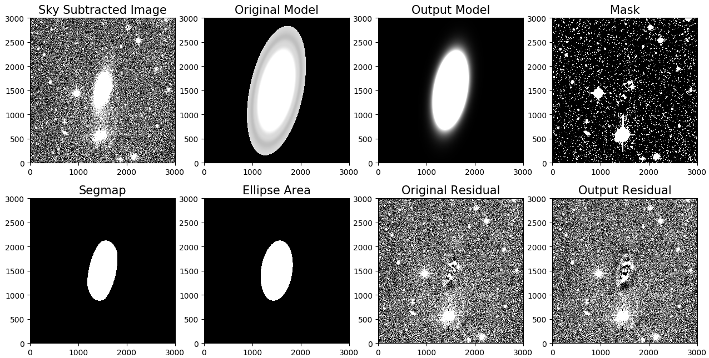

# statmorph_pipeline

## How To Run Statmorph Script

The following commands in `code blocks` will be entered in the terminal

### Step 1: Connect to Virtual Machine

In your terminal you can connect to the virtual machine with `ssh ubuntu@206.12.92.202`

The terminal should now show `ubuntu@ngvsui:~$`

### Step 2: Attach to tmux session

tmux allows you to open another terminal session to run in the background.

Attach to a session using `tmux attach`

If there are no sessions you can create one using `tmux new`

### Step 3: Navigate to statmorph directory (if you are not already in it)

`cd ~/statmorph_pipeline`

You should now see

`ubuntu@ngvsui:~/statmorph_pipeline$`

### Step 4: Clear previous script results and directories

If you are ready to run a new script and do not need the results from a previous run.  
Use &nbsp;&nbsp;`rm /mnt/scratch/check/*; rm /mnt/scratch/temp_galaxy_storage/*; rm /mnt/scratch/missing/*; rm /mnt/scratch/emptyseg/*; rm /mnt/scratch/largefile/*; rm ~/statmorph_pipeline/nohup.out`    
  
**Note:** You can use up/down arrow keys on keyboard for recently used commands to avoid typing all of that out
  
In the **Analyzing Results / Debugging section** I explain what these are. 

### Step 5: Start the script

Start the script with `nohup python3 script.py &`

You should see something similar to below (number is the parent process ID which will vary):

---

[1] 5780  
ubuntu@ngvsui:~/statmorph_pipeline$ nohup: ignoring input and appending output to 'nohup.out'

---

press [enter] after to enter next commands

### Step 6: Confirm script is running

You can check the status of processes running inside the tmux session with `ps`

**Note:** You will have to be attached to tmux session to view processes that started inside the session.

You should see something similar to below :

---

**PID &nbsp;&nbsp;&nbsp;&nbsp;&nbsp;TTY&nbsp;&nbsp;&nbsp;&nbsp;&nbsp;&nbsp;&nbsp;TIME&nbsp;&nbsp;&nbsp;&nbsp;&nbsp;&nbsp;&nbsp;&nbsp;&nbsp;&nbsp;&nbsp;&nbsp;CMD**  
5780 &nbsp;&nbsp;&nbsp;pts/1&nbsp;&nbsp;&nbsp;&nbsp;&nbsp;&nbsp;00:00:02&nbsp;&nbsp;&nbsp;&nbsp;&nbsp;&nbsp; python3  
5799 &nbsp;&nbsp;&nbsp;pts/1 &nbsp;&nbsp;&nbsp;&nbsp;&nbsp;00:00:00&nbsp;&nbsp;&nbsp;&nbsp;&nbsp;&nbsp; sh  
5800 &nbsp;&nbsp;&nbsp;pts/1  &nbsp;&nbsp;&nbsp;&nbsp;&nbsp;00:00:00&nbsp;&nbsp;&nbsp;&nbsp;&nbsp;&nbsp; vcp  
5807 &nbsp;&nbsp;&nbsp;pts/1  &nbsp;&nbsp;&nbsp;&nbsp;&nbsp;00:00:00&nbsp;&nbsp;&nbsp;&nbsp;&nbsp;&nbsp; ps  
24701 &nbsp;pts/1  &nbsp;&nbsp;&nbsp;&nbsp;&nbsp;00:00:01&nbsp;&nbsp;&nbsp;&nbsp;&nbsp;&nbsp; bash  

---

The **CMD** column represents the command which started a process.  
python3 represents script.py which just started.  
**Note:** This example uses a single process. Using multiprocessing would list more python3 processes.  

The **PID** column represents the process ID for a process. The process ID is a unique integer to represent a process.  
The **TIME** column represents the running time for a process.

### Step 7: Detach from tmux session

Now that the script has started in the background, you don't need to stay in the tmux session. It will take a long time to run.  
You can detach from the current session using `Ctrl + b` then `d`. If you detach, you can simply attach again.  
  
That's all there is to running the statmorph pipeline!

## Sample Output

  

## Analyzing Results / Debugging

I decided to create files representing a galaxy name for keeping logs on which galaxies had a different type of problem.

The following directories below are used for tracking galaxies with different kinds of issues after the script is finished :  
  
**~/statmorph_pipeline/nohup.out** : this file contains the output logs for the script.  
  
**mnt/scratch/check/** : all galaxies that were viewed and processed (would list all galaxies if script finished)  
  
**mnt/scratch/temp_galaxy_storage/** : directory to temporarily store galaxy files during processing. If the script crashes then one of the current galaxies in the directory were most likely the cause.  
  
**mnt/scratch/missing/** : galaxies which skipped processing because of missing one of the required files  
  
**mnt/scratch/emptyseg/** : galaxies which skipped processing because segmentation map was empty list with no area of interest  
  
**mnt/scratch/largefile/** : galaxies which had an galaxyName_G.fits file of size greater than 300MB  
  
You can find the total number of galaxies in a directory by using `ls | wc -l` 
